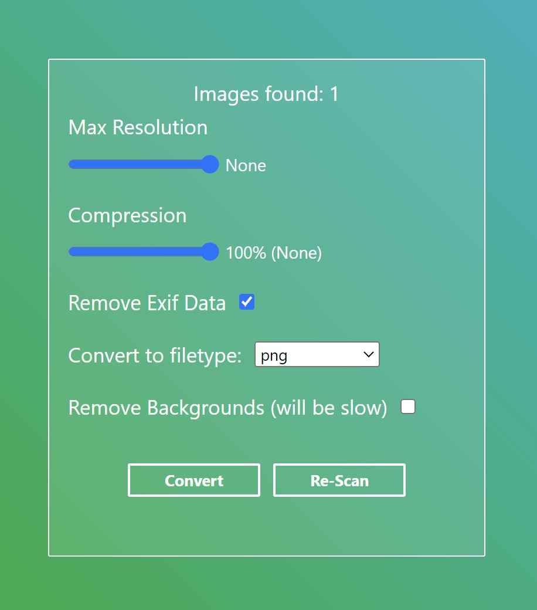

# Image Tools

These are some basic tools to quickly change image filetype, resolution, quality, and the ability to remove their background (if the image is a photo of a person)

## Installation

1. (optional) Create a python virtual env first
2. run the following command:
   ```python
   pip install -r requirements.txt
   ```
3. run the main python script
   ```python
   python image_tools.py
   ```

## Usage

Add images to the /input/ folder. Choose the settings you want, click convert.



If you add images after starting the program, click re-scan to update the images found.

## Build

Run `npm install` to get all the dependencies, then run `gulp` to build the UI files.

Run the following command to build the binary:

```sh
python -m eel image_tools.py web --paths={path/to/your/env/} -F --noconsole --add-data="pretrained\modnet_photographic_portrait_matting.ckpt;pretrained"
```

If you run into a warning of files already existed, copy paste the few lines of code from `file_error_fix.txt` into `image_tools.spec` and then run

```python
pyinstaller image_tools.spec
```
